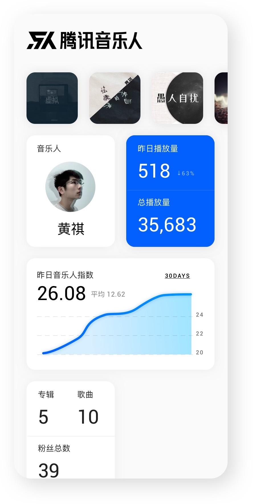

# Flutter Tencent Musician | 腾讯音乐人 - 由爱好者构建

> An unofficial app for tencent musician using Flutter | 用Flutter实现的腾讯音乐人后台App

## Getting Started

This project is a starting point for a Flutter application.

A few resources to get you started if this is your first Flutter project:

- [Lab: Write your first Flutter app](https://flutter.dev/docs/get-started/codelab)
- [Cookbook: Useful Flutter samples](https://flutter.dev/docs/cookbook)

For help getting started with Flutter, view our 
[online documentation](https://flutter.dev/docs), which offers tutorials, 
samples, guidance on mobile development, and a full API reference.

## TODOs

- [x] 账号登录
- [ ] 登录页面
- [ ] 数据概览页面
- [ ] 作品数据页面

## 备注

[flutter 踩坑（二）：获取webview中cookie的session](https://www.jianshu.com/p/55092eb06c17)